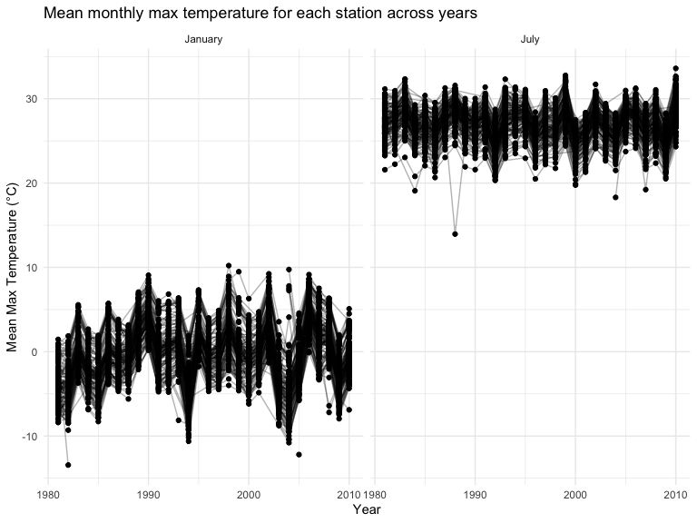
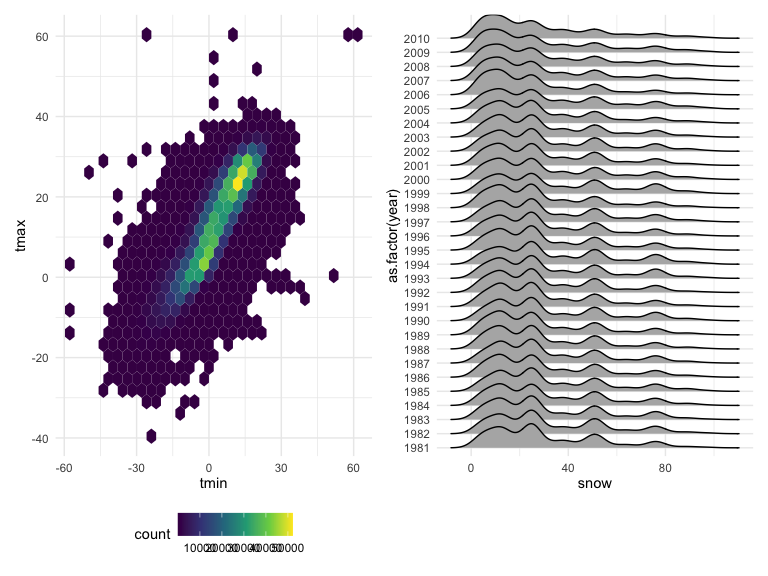
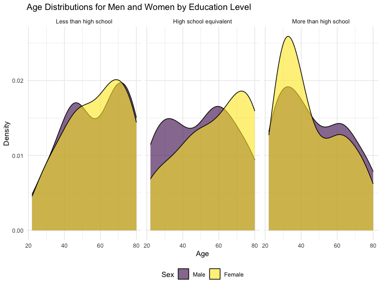
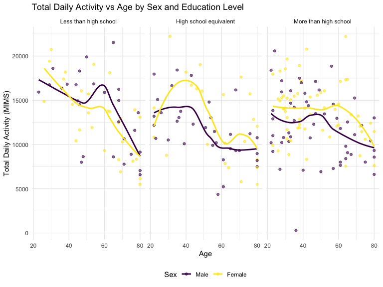

p8105_hw3_yg2964
================
2024-10-16

``` r
library(tidyverse)
```

    ## ── Attaching core tidyverse packages ──────────────────────── tidyverse 2.0.0 ──
    ## ✔ dplyr     1.1.4     ✔ readr     2.1.5
    ## ✔ forcats   1.0.0     ✔ stringr   1.5.1
    ## ✔ ggplot2   3.5.1     ✔ tibble    3.2.1
    ## ✔ lubridate 1.9.3     ✔ tidyr     1.3.1
    ## ✔ purrr     1.0.2     
    ## ── Conflicts ────────────────────────────────────────── tidyverse_conflicts() ──
    ## ✖ dplyr::filter() masks stats::filter()
    ## ✖ dplyr::lag()    masks stats::lag()
    ## ℹ Use the conflicted package (<http://conflicted.r-lib.org/>) to force all conflicts to become errors

``` r
library(ggridges)
library(patchwork)


library(p8105.datasets)

knitr::opts_chunk$set(
    echo = TRUE,
    warning = FALSE,
    fig.width = 8, 
  fig.height = 6,
  out.width = "90%"
)

theme_set(theme_minimal() + theme(legend.position = "bottom"))

options(
  ggplot2.continuous.colour = "viridis",
  ggplot2.continuous.fill = "viridis"
)

scale_colour_discrete = scale_colour_viridis_d
scale_fill_discrete = scale_fill_viridis_d
```

## Problem 1

### Section 1: Load the dataset

``` r
data("ny_noaa")
```

### Section 2: short description of the dataset

The NY NOAA dataset contains 2,595,176 observations and 7 variables. Key
variables include weather station ID (id), date of observation,
precipitation (prcp, in tenths of mm), snowfall (mm), snow depth (mm),
maximum temperature (tmax, in tenths of degrees Celsius), and minimum
temperature (tmin, in tenths of degrees Celsius).

### Section 3: Below we clean the data, creating separate variables for year, month, and day and converting tmax and tmin to numeric. We also examine the most commonly observed snowfall values:

``` r
ny_noaa_clean = 
  ny_noaa |> 
  separate(date, into = c("year", "month", "day"), convert = TRUE) |> 
  mutate(
    tmax = as.numeric(tmax) / 10,  # Convert to Celsius
    tmin = as.numeric(tmin) / 10   # Convert to Celsius
  )

ny_noaa_clean |> 
  count(snow) |> 
  arrange(desc(n))
```

    ## # A tibble: 282 × 2
    ##     snow       n
    ##    <int>   <int>
    ##  1     0 2008508
    ##  2    NA  381221
    ##  3    25   31022
    ##  4    13   23095
    ##  5    51   18274
    ##  6    76   10173
    ##  7     8    9962
    ##  8     5    9748
    ##  9    38    9197
    ## 10     3    8790
    ## # ℹ 272 more rows

We find that 0 is the most commonly observed value for snowfall. This is
because most days of the year, it does not snow at all in NY. The second
most commonly observed value is NA, indicating missingness. Other common
values are 25, 13, and 51 mm, suggesting that snowfall might have been
originally recorded in fractions of an inch (1 inch = 25.4 mm) and
converted to mm.

### Section 4: Below is a two-panel plot showing the average max temperature in January and in July in each station across years:

``` r
ny_noaa_clean |> 
  group_by(id, year, month) |> 
  filter(month %in% c(1, 7)) |> 
  summarize(mean_tmax = mean(tmax, na.rm = TRUE)) |> 
  ggplot(aes(x = year, y = mean_tmax, group = id)) + 
  geom_point() + 
  geom_path(alpha = 0.3) +
  facet_grid(~month, labeller = labeller(month = c("1" = "January", "7" = "July"))) +
  labs(title = "Mean monthly max temperature for each station across years",
       x = "Year", y = "Mean Max Temperature (°C)")
```

    ## `summarise()` has grouped output by 'id', 'year'. You can override using the
    ## `.groups` argument.


As expected, the mean temperature in January is much lower than in July
for all stations across all years. All stations appear to follow similar
trends of temperature peaks and valleys within a month across the years.
We can observe one uncharacteristically cold station in July of 1988, as
well as a few other less drastic outliers. There’s also a slight upward
trend in temperatures over the years, which could be indicative of
climate change.

### Section 5: Below we show a two-panel plot including (i) a hex plot of tmax vs tmin for the full dataset; and (ii) a ridge plot showing the distribution of snowfall values greater than 0 and less than 100 mm separately by year.

``` r
hex = 
  ny_noaa_clean |>  
  ggplot(aes(x = tmin, y = tmax)) + 
  geom_hex()
  


ridge = 
  ny_noaa_clean |> 
  filter(snow < 100, snow > 0) |> 
  ggplot(aes(x = snow, y = as.factor(year))) + 
  geom_density_ridges()
hex + ridge
```

    ## Picking joint bandwidth of 3.76



From the hex plot, we see that while there is some variability, the
majority of the data cluster tightly in the center of the distribution,
showing a strong positive correlation between maximum and minimum
temperatures. From the ridge plot, we see a multimodal density of
snowfall within a given year. Most stations see between 0 and 35 mm of
snow in a year. Then there is another group of stations that see about
45 mm of snow, and another group that sees nearly 80 mm. This
multimodality likely stems from the conversion of measurements from
inches to millimeters, which was also noted in the table of common
values.

## Problem 2

### Section 1: Data Preparation

``` r
# Load necessary packages
library(dplyr)
library(janitor)
```

    ## 
    ## Attaching package: 'janitor'

    ## The following objects are masked from 'package:stats':
    ## 
    ##     chisq.test, fisher.test

``` r
library(readr)

# Load and clean demographic data
demographics_data <- read_csv("nhanes_covar.csv", na = c("NA", "", ".", " "), skip = 4) |> 
  janitor::clean_names() |> 
  drop_na() |> 
  mutate(education = as.character(education), sex = as.character(sex)) |> 
  mutate(
    education = case_match(
      education,
      "1" ~ "Less than high school",
      "2" ~ "High school equivalent",
      "3" ~ "More than high school"),
    sex = case_match(
      sex,
      "1" ~ "Male",
      "2" ~ "Female"))
```

    ## Rows: 250 Columns: 5

    ## ── Column specification ────────────────────────────────────────────────────────
    ## Delimiter: ","
    ## dbl (5): SEQN, sex, age, BMI, education
    ## 
    ## ℹ Use `spec()` to retrieve the full column specification for this data.
    ## ℹ Specify the column types or set `show_col_types = FALSE` to quiet this message.

``` r
# Load and clean accelerometer data
accelerometer_data <- 
  read.csv("nhanes_accel.csv", na = c("NA", ".", "")) |> 
  janitor::clean_names()

# Merge the datasets based on participant ID (corrected)
accel_demo <- inner_join(accelerometer_data, demographics_data, by = "seqn")

# Filter participants by age and encode factors for sex and education
accel_demo <- accel_demo %>%
  filter(age > 21) %>%
  mutate(
    sex = factor(sex, levels = c("Male", "Female")),
    education = factor(education, levels = c(
      "Less than high school", 
      "High school equivalent", 
      "More than high school")
    )
  )
```

### Section 2:

#### 2.1 Create a table for the number of men and women in each education category

``` r
education_sex_table <- accel_demo |> 
  group_by(education, sex) |> 
  summarise(count = n()) |> 
  pivot_wider(names_from = sex, values_from = count)
```

    ## `summarise()` has grouped output by 'education'. You can override using the
    ## `.groups` argument.

``` r
  knitr::kable(education_sex_table)
```

| education              | Male | Female |
|:-----------------------|-----:|-------:|
| Less than high school  |   27 |     28 |
| High school equivalent |   34 |     23 |
| More than high school  |   54 |     59 |

Interpretation of the Table: From the table, we can observe the
following distribution of men and women across education levels: Less
than high school: There are 27 males and 28 females, making the
distribution quite balanced in this category. High school equivalent:
There are 34 males and 23 females, indicating a higher proportion of
males in this category. More than high school: There are 54 males and 59
females, making this the largest group overall, with a slightly higher
proportion of females.

#### 2.2 Visualization of Age Distributions by Sex and Education:

``` r
age_sex_plot <- 
  accel_demo |> 
  ggplot(aes(x = age, fill = sex)) +
  geom_density(alpha = 0.6) + 
  labs(
    title = "Age Distributions for Men and Women by Education Level",
    x = "Age",
    y = "Density",
    fill = "Sex"
  ) +
  facet_wrap(~ education) +  
  theme_minimal() +
  theme(legend.position = "bottom") 

age_sex_plot
```


Interpretation: - Less than High School: Men are concentrated around
ages 60-70, while women have a more even spread with peaks around ages
50 and 70. - High School Equivalent: Men have two peaks, around ages
40-50 and 70. Women are concentrated around ages 50-60. - More than High
School: Men peak around ages 40-50, while women have a younger
distribution, peaking around 30-40 and 50-60. In summary, women tend to
have a broader age distribution across education levels, while men are
more concentrated in specific age ranges, especially in higher education
categories

#### Section 3.1

``` r
# Calculate total daily activity for each participant
accel_demo_total <- accel_demo |> 
  rowwise() |> 
  mutate(total_activity = sum(c_across(starts_with("min")), na.rm = TRUE)) |> 
  ungroup()

# Create the plot
total_activity_plot <- ggplot(accel_demo_total, aes(x = age, y = total_activity, color = sex)) +
  geom_point(alpha = 0.6) +
  geom_smooth(method = "loess", se = FALSE) +
  facet_wrap(~ education) +
  labs(title = "Total Daily Activity vs Age by Sex and Education Level",
       x = "Age",
       y = "Total Daily Activity (MIMS)",
       color = "Sex") +
  theme_minimal() +
  theme(legend.position = "bottom")

print(total_activity_plot)
```

    ## `geom_smooth()` using formula = 'y ~ x'


